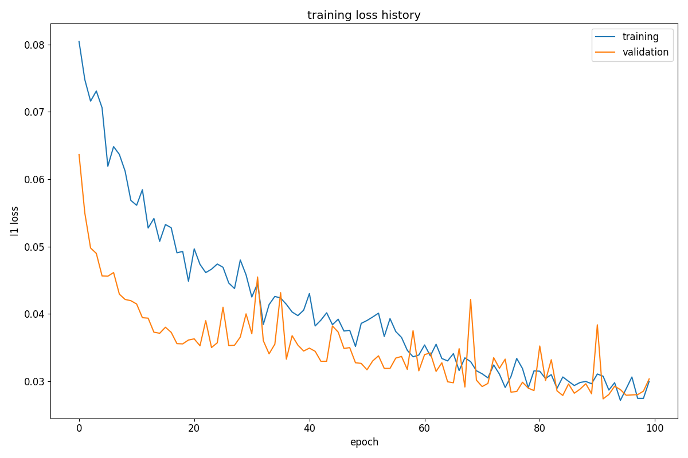

# Tree sequences as a general-purpose tool for population genetic inference

This repo and docs are still a work in progress, but hopefully should be finished soon.  If you are trying to run this code now or have other questions about it please contact ddray@email.unc.edu.

This repository contains details and instructions for replicating results in the associated manuscript, i.e. using GCN networks and inferred tree sequences from Relate (https://myersgroup.github.io/relate/) to predict demographic parameters or do model classification etc.

# Table of contents
1. [Installation](#installation)
2. [Simulation and inference with Relate](#sims)
    a. [Recombination](#sims_recom)
    b. [Demography](#sims_demography)
    c. [Introgression](#sims_intro)
    d. [Selection](#sims_selection)
4. [Formatting / pre-proccessing](#formatting)
    a. [GCN](#formatting_gcn)
    b. [CNN](#formatting_cnn)
5. [Training](#training)
    a. [GCN](#training_gcn)
    b. [CNN](#training_cnn)
6. [Evaluation](#eval)


## Installation <a name="installation"></a>
The code relies mostly on torch and torch-geometric.  We used torch==2.1.1+cu121 but any version compatible with the current torch-geometric should work. 

Other python pre-requisites:
```
pip install h5py matplotlib scipy numpy mpi4py
```
mpi4py and MPI are needed to run the parallel formatting routines for training CNN models that run on sorted (and matched) genotype matrices.  If you only want to use the GCN part of this repo, you won't need them.

After installing torch (https://pytorch.org/get-started/locally/), we recommend installing torch-geometric (and its pre-requisities) from source:

```
# install the pre-reqs (pyg-lib, torch-cluster, torch-scatter, torch-sparse, and torch-spline-conv)
git clone https://github.com/pyg-team/pyg-lib.git
cd pyg-lib
python3 setup.py install && cd ..

git clone https://github.com/rusty1s/pytorch_cluster.git
cd pytorch_cluster
python3 setup.py install && cd ..

git clone https://github.com/rusty1s/pytorch_scatter.git
cd pytorch_scatter
python3 setup.py install && cd ..

git clone https://github.com/rusty1s/pytorch_sparse.git
cd pytorch_sparse
python3 setup.py install && cd ..

git clone https://github.com/rusty1s/pytorch_spline_conv.git
cd pytorch_spline_conv
python3 setup.py install && cd ..

# finally install torch geometric
git clone https://github.com/pyg-team/pytorch_geometric.git
cd pytorch_geometric
python3 setup.py install
```
We use various genetic simulators to accomplish the experiments.  We include the source for ms twice in two different folders as it is meant to be built two different ways: 
```
cd msdir/
gcc -O3 -o ms ms.c streec.c rand1.c -lm

cd ../msdir_rand2/
gcc -O3 -o ms ms.c streec.c rand2.c -lm
```
This is done as our simulation commands for ms that include no introgression between populations produce a SegFault when ms is built with rand1.c for whatever reason.

For the selection sims, you'll need `discoal`: 

```
git clone https://github.com/kr-colab/discoal.git
cd discoal
make discoal
```

Relate is included as a submodule in this repo and should be built like:
```
cd relate/build
cmake ..
make all
```

---
## Simulations and inference with Relate <a name="sims"></a>

### Recombination <a name="sims_recombination"></a>

We simulate replicates with a present day sample size of 50 and with N (the effective population size) = 14714, mu (mutation rate) 1.5e-8, and a variable recombination rate to predict from inferred trees or the binary genotype matrix.  The ms simulation commands we used are included in the repo as `recom.runms.sh`.  To run them all (~225k replicates) locally:

```
# will take a while
python3 src/data/simulate_recombination.py --odir data/recom
```

or with sbatch on a cluster with SLURM:

```
python3 src/data/simulate_recombination.py --odir data/recom --slurm
```

This results are compressed ms text files (*.msOut.gz) which each have 1000 replicates in them and look like:

```
//	12.0006	319.080439014646
segsites: 70
positions: 0.0014 0.0161 0.0231 0.0525 0.0580 ...
0000001000000000000111000001000001100011110000101000000001000000010100
0101001000001000101001000001000001101000000000101000001010000001110100
0000001000001000000111000000010001110000000000000000000001000001110010
0100001000000000000111000001000100001000000100001000000001011110010100
...
```

This is the format of the genotype data our routines expect if you wish to use this with other simulation results or real data.  In the formatting step, we take the parameters to predict from the line with `\\` or ignore them in the case that we are doing classification.  

We can now infer the tree sequences for each replicate by calling Relate via Python like:

```
python3 src/data/relate.py --L 20000 --mu 1.5e-8 --r 1e-7 --N 14714 --idir data/recom/ --odir data/recom_relate --n_samples 50
```

### Demography <a name="sims_demography"></a>

For demography the sample size is again 50 and we simulate over 5 different demographic parameters detailed in the manuscript.  To generate (100k replicates):

```
python3 src/SLURM/simulate_demography_data.py --odir data/demography
python3 src/SLURM/simulate_demography_data.py --odir data/demography --slurm # if on a cluster
```

To run Relate on each of the output folders:

```
python3 src/SLURM/relate_distributed.py --L 150000 --mu 1.2e-9 --r 1e-8 --N 1000 --n_samples 50 \
                    --idir data/demography --odir data/demography_relate
python3 src/SLURM/relate_distributed.py --L 150000 --mu 1.2e-9 --r 1e-8 --N 1000 --n_samples 50 \
                    --idir data/demography --odir data/demography_relate --slurm # if on a cluster
```

Here we used the src/SLURM script which calls the src/data/relate.py routine that we used in the recombination case. `simulate_demography_data.py` writes the ms files to individual folders which allows for the work of Relate to be spread over many cpus via sbatch if available.

### Introgression <a name="sims_intro"></a>

We simulated a demographic model of introgression between Drosophila Sechellia and D. Simulans using the same routine as in https://github.com/SchriderLab/introNets.  The demographic model parameters were estimated using DADI (https://github.com/SchriderLab/introNets/tree/main/dadiBootstrapCode).  We include the resulting parameters in `params.txt`.  To simulate (with ms):

```
python3 src/data/simulate_msmodified.py --ifile params.txt --odir data/dros/ab --direction ab # use --slurm with this script as well if you have sbatch
python3 src/data/simulate_msmodified.py --ifile params.txt --odir data/dros/ba --direction ba
python3 src/data/simulate_msmodified.py --ifile params.txt --odir data/dros/bi --direction bi
```

This will generate 1000 replicates for each of the 42 parameters that we include from the params.txt file (we throw out parameters that have a log-likelihood < -2000).

Then we can infer the tree sequences using Relate:

```
python3 src/SLURM/relate_distributed.py --idir data/dros/ab --odir data/dros_relate/ab \
          --L 10000 --N 266863 --r 2e-8 --mu 5e-9 --n_samples 34 # use --slurm with this script as well if you have sbatch
python3 src/SLURM/relate_distributed.py --idir data/dros/ba --odir data/dros_relate/ba \
          --L 10000 --N 266863 --r 2e-8 --mu 5e-9 --n_samples 34
python3 src/SLURM/relate_distributed.py --idir data/dros/bi --odir data/dros_relate/bi \
          --L 10000 --N 266863 --r 2e-8 --mu 5e-9 --n_samples 34
```

### Selection <a name="sims_selection"></a>

We simulated five different scenarios involving selection as detailed in the paper.  The current routine is only compatible with SLURM:

```
# simulates 100k of each category by submitting 10000 jobs with 10 replicates each
python3 src/data/simulate_selection.py --odir /work/users/d/d/ddray/selection_sims
```

It's helpful for this case to chunk the data for pre-processing.  This script splits and copies the ms files in selection_sims to some number of individual folders in `--odir`:

```
python3 src/data/chunk_data.py --idir /work/users/d/d/ddray/selection_sims \
           --odir /work/users/d/d/ddray/selection_sims_chunked --n_per 250 # the number of ms files per folder
```

Finally, we can infer with relate via:

```
python3 src/SLURM/relate_distributed.py --idir /work/users/d/d/ddray/selection_sims_chunked --odir some_dir \
                    --L 110000 --mu 1.5e-8 --r 1e-8 --N 10000 --n_samples 104 --slurm
```

## Formatting / pre-proccessing <a name="formatting"></a>

### GCN <a name="formatting_gcn"></a>

First we convert the tree sequences output via our Relate routines (which are output as compressed Newick test to *.anc.gz files) to arrays of node features and edge indices and save them to a an hdf5 file.  For recombination: 

```
python3 src/data/format_relate.py --idir data/recom_relate --ms_dir data/recom/ --pop_sizes 50,0 --ofile recom.hdf5
```

Next we split the data into a training and validation set, and trim sequences longer than 128 trees (make sure to specify the full path for the output file and `--classes none` in the case of regression):

```
python3 src/data/combine_h5s.py --i recom.hdf5 --ofile ./recom_combined.hdf5 --classes none
```
By default the validation proportion is 0.1, but can be changed with the `--val_prop` argument.  The validation data is written to a separate hdf5 file with the same name but the suffix `_val.hdf5`.

The h5 file's structure can be seen here:
```
>>> import h5py
>>> ifile = h5py.File('recom_combined.hdf5','r')
>>> ifile['000000'].keys() # each key points to a 'chunk' of data which has 5 replicates in it in this case
<KeysViewHDF5 ['edge_index', 'global_vec', 'mask', 'x', 'x1', 'y']>
>>> ifile['000000/edge_index'] # topology of the trees
<HDF5 dataset "edge_index": shape (5, 128, 2, 99), type "<i4">
>>> ifile['000000/global_vec'] # tree sequence summary statistics
<HDF5 dataset "global_vec": shape (5, 37), type "<f4">
>>> ifile['000000/x'] # node features [age (zero if leaf node), number of mutations of the branch to parent, one hot encoded population label with ancestral population]
<HDF5 dataset "x": shape (5, 128, 99, 4), type "<f4">
>>> ifile['000000/x1'] # tree summary statistics
<HDF5 dataset "x1": shape (5, 128, 12), type "<f8">
>>> ifile['000000/y'] # y-vector (only a key for regression problems)
<HDF5 dataset "y": shape (5, 2), type "<f4">
```

### CNN <a name="formatting_cnn"></a>

We can work directly with the ms files since we're only using genotype matrices for the CNN.  Before formatting, you can find the max observed number of sites in your data:

```
python3 src/data/get_max_L.py --idir data/recom/
100%|████████████████████████████████████████████████████████████████████████████████████████████████████████████████████████████████████████████████████████████████████| 210/210 [04:12<00:00,  1.20s/it]
INFO:root:have max number of sites: 413
```

Because we use seriation to sort the individuals in the genotype matrix (and potentially linear matching if there are two populations) which is costly, we parallize the operation over some number of CPU cores to make it faster. For the recombination example the formatting command would be:

```
# 1 population with 50 individuals with a zero padded size of 413 segregating sites
mpirun -n 4 python3 src/data/format_genomat.py --idir data/recom/ --ofile ./recom_413.hdf5 --out_shape 1,50,413 --mode seriate --regression --pop_sizes 50,0
```

## Training <a name="training"></a>

### GCN <a name="training_gcn"></a>

Before running the training routines for the GCN it is required to compute the mean and standard deviation of the node features (and the y-variable in the case of regression) with the training set:

```
python3 src/data/compute_means.py --ifile recom_combined.hdf5 --regression --y_ix 1 --ofile recom_means.npz 
```

The GCN training script has various options:
```
--verbose             display messages
  --ifile IFILE         training h5 file
  --ifile_val IFILE_VAL
                        validation h5 file
  --odir ODIR           output directory where we save weights and logs of training progress
  --n_epochs N_EPOCHS   number of training epochs to perform
  --lr LR               learning rate for Adam optimizer
  --n_early N_EARLY     number of epochs to early stop if validation loss hasn't gone down
  --lr_decay LR_DECAY   if specified as a float will apply exponential learning rate decay (not recommended). other learning schedules could help in theory, but arent currently implemented
  --n_per_batch N_PER_BATCH
                        number of h5 chunks per batch. batch size will be chunk_size * n_per
  --L L                 deprecated...
  --n_steps N_STEPS     number of steps per epoch (if -1 all training examples are run each epoch)
  --label_smoothing LABEL_SMOOTHING
                        whether to use label smoothing in classification tasks. if non zero
  --in_dim IN_DIM       number of input dimensions
  --n_classes N_CLASSES
                        number of output dimensions of the network
  --regression          specifies that were doing regression of a vector or scalar rather than logistic scores. important for specifying the right loss function
  --classes CLASSES     class labels if doing classification
  --y_ix Y_IX           for regression. if predicting a single scalar, its the desired index of the y vectors saved to the h5 file
  --log_y               for regression. whether the dataloader should return log scaled values of the y variables
  --model MODEL         gru | conv. Type of architecture to use, specifying the type of sequential downsampling or processing employed (gated recurrent or convolutional). we recommend the GRU
  --hidden_dim HIDDEN_DIM
                        for gru.
  --n_gru_layers N_GRU_LAYERS
                        for gru. the number of gru layers to use
  --n_gcn_iter N_GCN_ITER
                        the number of gcn convolutional layers used
  --gcn_dim GCN_DIM     the output dimension of the gcn layers
  --n_conv N_CONV       for conv. number of 1d convolution layers in each block
  --weights WEIGHTS     pre-trained weights to load to resume training or fine tune a model
  --weight_decay WEIGHT_DECAY
                        weight decay for Adam optimizer
  --momenta_dir MOMENTA_DIR
                        deprecated...
  --save_momenta_every SAVE_MOMENTA_EVERY
                        deprecated...
  --means MEANS         prewritten mean-std values for the inputs and ouputs (in the case of regression)
  --n_val_steps N_VAL_STEPS
                        in the case you want to validate on a smaller set than the one written
```

Training a GCN network to predict the recombination rate:

```
python3 src/models/train_gcn.py --ifile recom_combined.hdf5 --ifile_val recom_combined_val.hdf5 --means recom_means.npz --odir test_recom_training --y_ix 1 --regression --n_classes 1
```

We'll find a plot of the training and validation loss, a log file, and a CSV containing the metrics and training times per epoch.



### CNN <a name="training_cnn"></a>

The CNN training script has similar options:

```
usage: train_cnn.py [-h] [--verbose] [--ifile IFILE] [--ifile_val IFILE_VAL] [--in_channels IN_CHANNELS] [--n_classes N_CLASSES] [--y_ix Y_IX] [--log_y] [--means MEANS] [--n_epochs N_EPOCHS]
                    [--n_steps N_STEPS] [--lr LR] [--weight_decay WEIGHT_DECAY] [--label_smoothing LABEL_SMOOTHING] [--n_early N_EARLY] [--model MODEL] [--batch_size BATCH_SIZE] [--weights WEIGHTS]
                    [--regression] [--odir ODIR]

optional arguments:
  -h, --help            show this help message and exit
  --verbose             display messages
  --ifile IFILE         data from src/data/format_genomat. has the genotype matrices for loading during training
  --ifile_val IFILE_VAL
                        same as ifile but for validation
  --in_channels IN_CHANNELS
                        number of population channels in the image
  --n_classes N_CLASSES
                        number of classes to predict or the dimension of the y variable
  --y_ix Y_IX           for regression. if predicting a single scalar, its the desired index of the y vectors in the h5 file
  --log_y               whether the y variables should be in log space. only applicable to regression tasks
  --means MEANS         y means and stds for normalization. only applicable to regression tasks
  --n_epochs N_EPOCHS   number of training epochs to perform
  --n_steps N_STEPS     the number of optimizer steps to take each epoch. -1 for all the training examples.
  --lr LR               learning rate for the Adam optimizer
  --weight_decay WEIGHT_DECAY
                        weight decay for Adam optimizer. see https://pytorch.org/docs/stable/generated/torch.optim.Adam.html
  --label_smoothing LABEL_SMOOTHING
                        whether to use label smoothing in classification tasks if non zero. see the module in src/models/train_gcn.py
  --n_early N_EARLY     number of epochs to early stop if validation loss hasn't gone down
  --model MODEL         res | lex. 'res' for resnet34 architecture or 'lex' for a architecture similiar to the one used inhttps://academic.oup.com/mbe/article/36/2/220/5229930?login=false
  --batch_size BATCH_SIZE
                        batch sized used each gradient step
  --weights WEIGHTS     pre-trained weights to load to resume training or fine tune a model
  --regression          pre-trained weights to load to resume training or fine tune a model
  --odir ODIR           output directory where we save weights and logs of training progress
```

Training a CNN to predict the recombination rate with the default ResNet34 architecture (https://pytorch.org/vision/main/models/generated/torchvision.models.resnet34.html):

```
python3 src/models/train_cnn.py --ifile recom_512.hdf5 --ifile_val recom_512_val.hdf5 --regression --in_channels 1 --n_classes 1 --y_ix 1 --means recom_means.npz --odir test_recom_cnn 
```

## Evaluation / testing

Models were run on testing data using the relevant scripts in `/src/viz` and resulting final plots for the manuscript are located in `/plots`.
